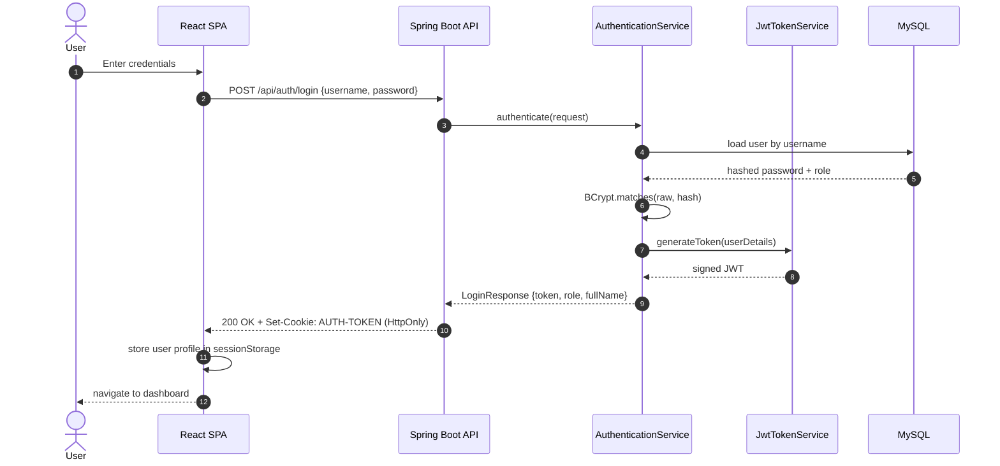
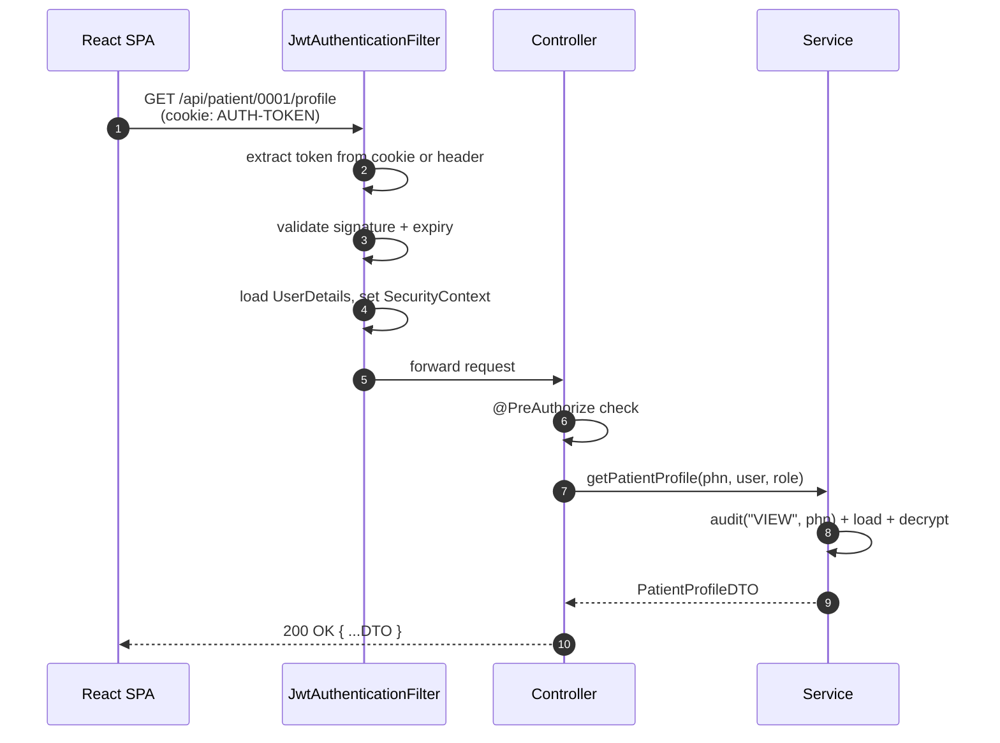
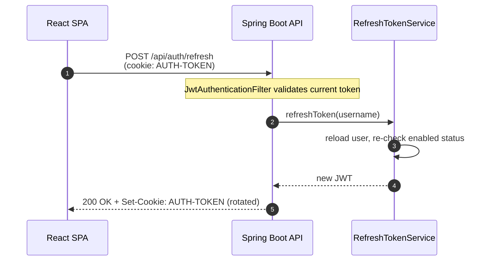

# Authentication & Authorization Flow

## Login + Token Issuance

```mermaid
sequenceDiagram
    autonumber
    actor User
    participant SPA as React SPA
    participant API as Spring Boot API
    participant Auth as AuthenticationService
    participant Jwt as JwtTokenService
    participant DB as MySQL

    User->>SPA: Enter credentials
    SPA->>API: POST /api/auth/login {username, password}
    API->>Auth: authenticate(request)
    Auth->>DB: load user by username
    DB-->>Auth: hashed password + role
    Auth->>Auth: BCrypt.matches(raw, hash)
    Auth->>Jwt: generateToken(userDetails)
    Jwt-->>Auth: signed JWT
    Auth-->>API: LoginResponse {token, role, fullName}
    API-->>SPA: 200 OK + Set-Cookie: AUTH-TOKEN (HttpOnly)
    SPA->>SPA: store user profile in sessionStorage
    SPA-->>User: navigate to dashboard
```

## Authenticated Request

```mermaid
sequenceDiagram
    autonumber
    participant SPA as React SPA
    participant Filter as JwtAuthenticationFilter
    participant Ctrl as Controller
    participant Svc as Service

    SPA->>Filter: GET /api/patient/0001/profile<br/>(cookie: AUTH-TOKEN)
    Filter->>Filter: extract token from cookie or header
    Filter->>Filter: validate signature + expiry
    Filter->>Filter: load UserDetails, set SecurityContext
    Filter->>Ctrl: forward request
    Ctrl->>Ctrl: @PreAuthorize check
    Ctrl->>Svc: getPatientProfile(phn, user, role)
    Svc->>Svc: audit("VIEW", phn) + load + decrypt
    Svc-->>Ctrl: PatientProfileDTO
    Ctrl-->>SPA: 200 OK { ...DTO }
```

## Token Refresh

```mermaid
sequenceDiagram
    autonumber
    participant SPA as React SPA
    participant API as Spring Boot API
    participant Refresh as RefreshTokenService

    SPA->>API: POST /api/auth/refresh<br/>(cookie: AUTH-TOKEN)
    Note over API: JwtAuthenticationFilter validates current token
    API->>Refresh: refreshToken(username)
    Refresh->>Refresh: reload user, re-check enabled status
    Refresh-->>API: new JWT
    API-->>SPA: 200 OK + Set-Cookie: AUTH-TOKEN (rotated)
```
