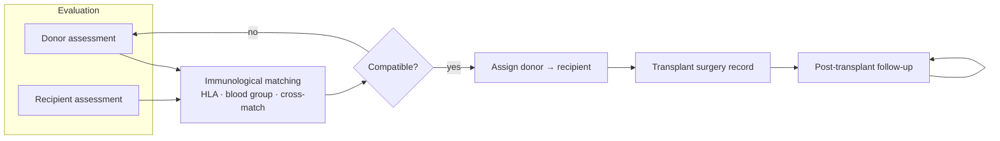
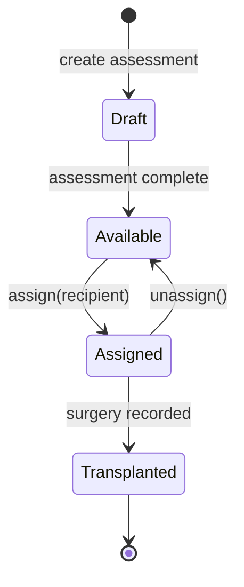
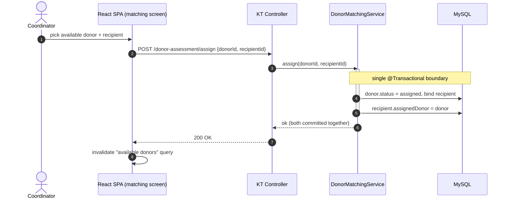
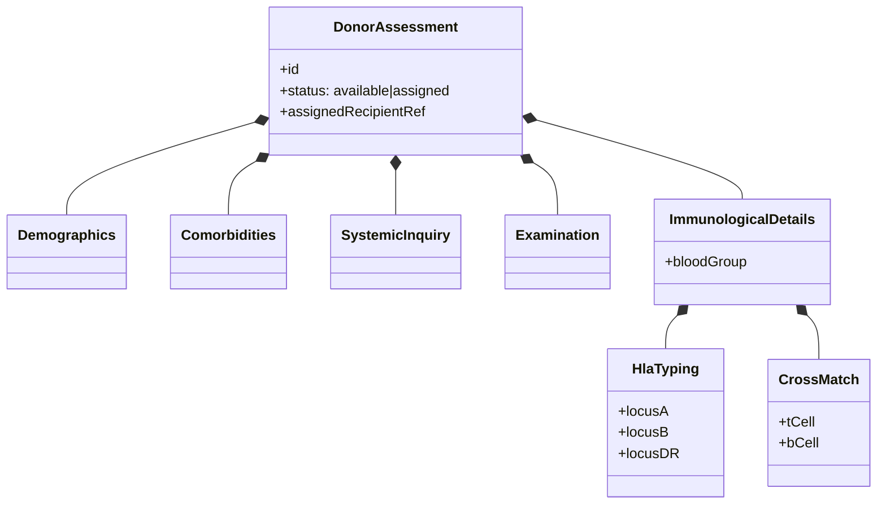

# Kidney Transplant — Workflow Diagrams

## 1. The transplant pipeline

## 2. Donor record state machine

A donor that passes assessment enters the `available` pool. Assignment binds the
donor to a recipient; unassignment returns it to the pool. Modeling this
explicitly on the donor record kept the matching rules and UI simple.

## 3. Assignment as a single transaction

## 4. Assessment aggregate (nested data shape)

