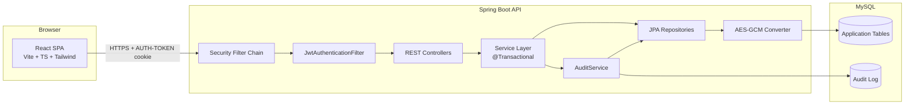

# System Architecture Diagram

## Component Responsibilities

| Component                  | Owns                                                      |
| -------------------------- | --------------------------------------------------------- |
| `SecurityFilterChain`      | Path-based access rules, CSRF/CORS config                 |
| `JwtAuthenticationFilter`  | Token extraction, signature verification, context setup   |
| Controllers                | HTTP shape, DTO validation, `@PreAuthorize`               |
| Services                   | Business rules, transaction boundaries, audit calls       |
| `AuditService`             | Structured access logging, same-tx as the action          |
| `JpaAesGcmStringConverter` | Transparent field encryption on flagged columns           |
| Repositories               | Spring Data JPA queries                                   |
